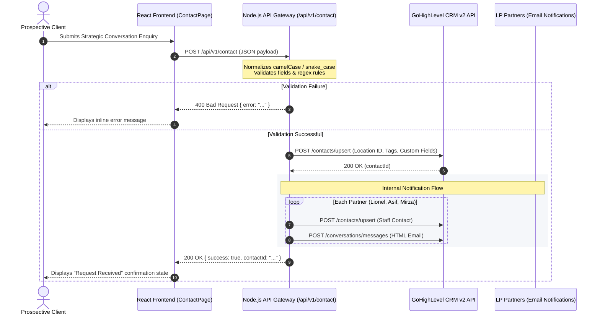

# Contact Us API — Engineering Handover & Integration Specification

**Module:** Strategic Conversation / Contact Us Form Integration  
**Backend Service:** `lp_backend` (Node.js / Express / TypeScript)  
**Consumer:** `lp_frontend` (`ContactPage.tsx`)  
**CRM Integration:** GoHighLevel (GHL) REST API v2  
**Status:** Implemented, Tested & Verified  

---

## 1. Architecture & Data Flow

When a prospective client submits an enquiry on the website, the request passes through the Express API gateway, gets validated against enterprise input rules, and synchronizes with GoHighLevel to create/update the lead and trigger team notifications.



---

## 2. Endpoint Specification

| Attribute | Specification |
| :--- | :--- |
| **HTTP Method** | `POST` |
| **Primary Route** | `/api/v1/contact` |
| **Route Aliases** | `/api/contact`, `/api/v1/contact-us`, `/api/contact-us` |
| **Client Helper** | `apiUrl('/api/v1/contact')` from `@/lib/api-config` |
| **Content-Type** | `application/json` |
| **Authentication** | None (Public endpoint protected with server-side validation) |
| **Interactive Docs**| Swagger UI: `http://localhost:4000/api-docs` *(Tag: Contact)* |

---

## 3. Request Payload Schema

The endpoint accepts **both `camelCase` (React form standard)** and **`snake_case`**.

| Field (camelCase) | Field (snake_case) | Type | Required | Limits & Validation Rules | Description |
| :--- | :--- | :---: | :---: | :--- | :--- |
| `firstName` | `first_name` | `string` | **Yes** | 2–50 chars (`/^[A-Za-zÀ-ÖØ-öø-ÿ' -]+$/`) | First name of applicant |
| `lastName` | `last_name` | `string` | **Yes** | 2–50 chars (`/^[A-Za-zÀ-ÖØ-öø-ÿ' -]+$/`) | Last name of applicant |
| `company` | `company` | `string` | **Yes** | 2–100 chars (`/^[A-Za-z0-9À-ÖØ-öø-ÿ&.,'()\- ]+$/`) | Organisation name |
| `role` | `role` | `string` | **Yes** | 2–100 chars (`/^[A-Za-z0-9À-ÖØ-öø-ÿ&/.,'()\- ]+$/`) | Job title or executive role |
| `email` | `email` | `string` | **Yes** | Max 254 chars, valid email format | Work or corporate email |
| `phone` | `phone` | `string` | No | 7–20 chars (`/^\+?[0-9\s()\-]+$/`) | Phone or WhatsApp number |
| `preferredContact` | `preferred_contact_method` | `string` | No | `email`, `phone`, `whatsapp`, `phone or whatsapp` | Communication preference |
| `preparingFor` | `message` | `string` | **Yes** | 10–1,000 chars | What the applicant is preparing for |

### Example Request (camelCase - Frontend Standard)
```json
{
  "firstName": "John",
  "lastName": "Doe",
  "company": "Acme Capital",
  "role": "Chief Executive Officer",
  "email": "john.doe@acme.com",
  "phone": "+971 50 123 4567",
  "preferredContact": "email",
  "preparingFor": "Preparing for international restructuring and scaling executive leadership."
}
```

---

## 4. Response Codes & Schema

### `200 OK` (Success)
Returned when the contact is upserted into GoHighLevel and notification emails are dispatched.
```json
{
  "success": true,
  "contactId": "BULJd0T0KqVbdEzcAmjd"
}
```

### `400 Bad Request` (Validation Error)
Returned when any client input fails validation. The `error` property contains a human-readable message to display in the UI.
```json
{
  "error": "First name must be at least 2 characters."
}
```

**Common error messages:**
- `"Please provide your first name."`
- `"First name must be at least 2 characters."` / `"First name cannot exceed 50 characters."`
- `"First name can only contain letters, spaces, hyphens, and apostrophes."`
- `"Please provide your last name."`
- `"Please provide your company or organisation."`
- `"Please provide your role or title."`
- `"Please provide a valid email address (e.g. name@company.com)."`
- `"Please provide a valid phone number (e.g. +971 50 123 4567)."`
- `"Please describe what you are preparing for."`
- `"Description must be at least 10 characters."` / `"Description cannot exceed 1,000 characters."`
- `"Please select a valid preferred contact method."`

### `500 Internal Server Error` (System / CRM Error)
```json
{
  "error": "Failed to process contact submission"
}
```

---

## 5. GoHighLevel (GHL) CRM Integration Details

1. **Contact Tags Created**:
   - `'Contact Us Form'`
   - `'Website Lead'`
   - `'Preferred: EMAIL'` (or `PHONE`, `WHATSAPP`, `PHONE OR WHATSAPP`)
2. **Contact Custom Fields**:
   - `role`: Executive role / title
   - `preferred_contact_method`: Contact channel preference
   - `message`: Description of what they are preparing for
3. **Source Tagging**:
   - `source`: `'Leaders Performance Website Contact Form'`
4. **Internal Notification Recipients**:
   - `asif@leadersperformance.ae` (Muhammad Asif)
   - `mirza@leadersperformance.ae` (Mirza Asad)
   - `info@leadersperformance.ae` (Lionel Eersteling)

---

## 6. Frontend Implementation Guide

File: `lp_frontend/src/modules/contact/ContactPage.tsx`

```tsx
import React, { useState } from 'react';
import { apiUrl } from '../../lib/api-config';

export const ContactPage: React.FC = () => {
  const [formData, setFormData] = useState({
    firstName: '',
    lastName: '',
    company: '',
    role: '',
    email: '',
    phone: '',
    preparingFor: '',
    preferredContact: 'email',
    agreeToTerms: false,
  });

  const [isSubmitting, setIsSubmitting] = useState(false);
  const [errorMessage, setErrorMessage] = useState<string | null>(null);
  const [submitted, setSubmitted] = useState(false);

  const handleChange = (e: React.ChangeEvent<HTMLInputElement | HTMLTextAreaElement>) => {
    const { name, value, type } = e.target;
    if (type === 'checkbox') {
      const { checked } = e.target as HTMLInputElement;
      setFormData((prev) => ({ ...prev, [name]: checked }));
    } else {
      setFormData((prev) => ({ ...prev, [name]: value }));
    }
  };

  const handleSubmit = async (e: React.FormEvent) => {
    e.preventDefault();
    if (!formData.agreeToTerms) return;

    setIsSubmitting(true);
    setErrorMessage(null);

    try {
      const response = await fetch(apiUrl('/api/v1/contact'), {
        method: 'POST',
        headers: { 'Content-Type': 'application/json' },
        body: JSON.stringify(formData),
      });

      const data = await response.json();

      if (!response.ok) {
        throw new Error(data.error || 'Failed to submit enquiry.');
      }

      setSubmitted(true);
    } catch (err: any) {
      setErrorMessage(err.message || 'An unexpected error occurred. Please try again.');
    } finally {
      setIsSubmitting(false);
    }
  };

  // Render form with {isSubmitting && 'Submitting...'} and {errorMessage && <div className="text-red-400">{errorMessage}</div>}
};
```

---

## 7. Backend Environment Variables (`lp_backend/.env`)

Ensure the following keys exist in your `.env`:

```env
# GoHighLevel API Configuration
GHL_BASE="https://services.leadconnectorhq.com"
GHL_API_KEY="pit-a8a37482-72a0-4051-b117-1b99df6b6ae2"
GHL_LOCATION_ID="pP8zZxtNvTuN3UqadKCp"
```

---

## 8. Verification & Test Suite

All tests can be executed via:
```bash
npm test -- src/__tests__/contact.test.ts
```
**Test Coverage:**
- Missing mandatory fields validation (400)
- RFC email format validation (400)
- Character bounds & regex validation (400)
- CamelCase frontend payload acceptance (200)
- Snake_case payload acceptance (200)
- GHL contact upsertion and email delivery mock tests (200)
